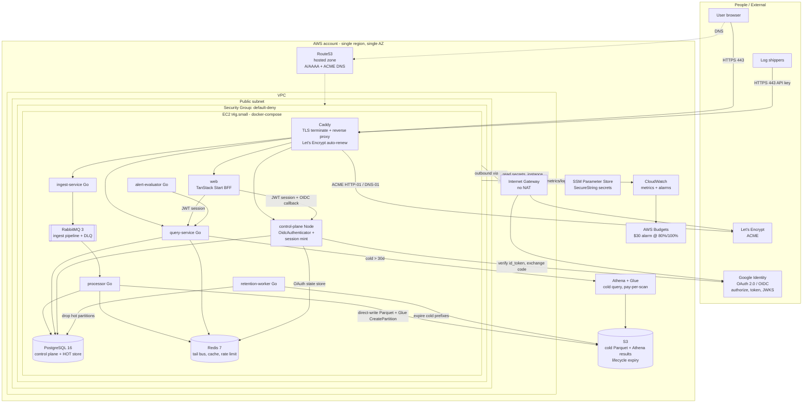

# Logalot — Google OAuth + AWS Deployment Topology

**Status:** Accepted (Phase 1) · **Date:** 2026-06-28 · **Owner:** systems architect

Companion to [`overview.md`](./overview.md). This document is descriptive; the load-bearing decisions are the
ADRs and they win on disagreement:

- [ADR-0008 Google OIDC sign-in integration](../adr/0008-google-oidc-signin.md)
- [ADR-0009 AWS deployment topology — single Graviton EC2 + compose](../adr/0009-aws-deployment-topology.md)
- [ADR-0010 IaC tooling, secrets, and TLS](../adr/0010-iac-secrets-tls.md)
- [ADR-0011 Cost as a first-class NFR — AWS PoC budget and instance sizing](../adr/0011-cost-nfr-aws-poc.md)

---

## 1. C4 Container view — deployed AWS topology (PoC)

Everything inside `box` runs as containers on **one t4g.small Graviton EC2 instance** via the existing
`docker-compose` (minus `mongodb` and `floci`, which are local-dev only — real S3/Athena replace floci in the
cloud). Managed AWS services are minimal and real.



### What is managed vs self-hosted

| Concern | Cloud choice | Rationale (ADR) |
|---|---|---|
| Compute | 1× t4g.small EC2 + compose | Cheapest credible PoC (0009, 0011) |
| Postgres / Redis / RabbitMQ | **Self-hosted** containers on the box | Avoid RDS/ElastiCache/MQ monthly bills (0009, 0011) |
| Cold storage + query | **S3 + Athena/Glue** (real) | Already the design; unblocks `cold_smoke_aws` (0005) |
| Secrets | **SSM Parameter Store** SecureString | Free tier; cheaper than Secrets Manager (0010) |
| TLS | **Caddy + Let's Encrypt** on the box | Free auto-renew; OAuth needs HTTPS; no ALB (0010) |
| DNS | **Route53** hosted zone | Real domain for OAuth + ACME (0010) |
| Egress | Public subnet + **IGW, no NAT** | NAT GW > whole compute budget (0009) |
| Guardrail | **AWS Budgets** $30 alarm | Enforced cost ceiling (0011) |

---

## 2. Google OAuth sign-in flow (Track A)

Invite-only / link-existing, **multi-tenant membership** (one Google account can sign into many tenants).
`client_secret` lives server-side in `control-plane`; the `web` BFF holds only `client_id` + `redirect_uri`.
`state`, `nonce`, and the **PKCE `code_verifier`** are **minted by control-plane and stored in one Redis
record** (atomic single-use), with a **browser-binding cookie** as a second factor; the tenant comes from the
**tenant-scoped login page** (ADR-0008; threat-model R4/R5/R6/R11).

```mermaid
sequenceDiagram
    participant B as Browser
    participant W as web (BFF)
    participant G as Google (OIDC)
    participant C as control-plane (OidcAuthenticator)
    participant RS as Redis (OAuthStateStore)
    participant DB as Postgres (users, oauth_identities, RLS)

    B->>W: open tenant-scoped login page; click "Sign in with Google"
    W->>C: POST /auth/oidc/google/begin { tenant_slug }
    C->>C: mint state, nonce, code_verifier; code_challenge=S256(verifier)
    C->>RS: SET state -> {tenant_id, nonce, code_verifier} TTL ~10m
    C-->>W: authorize params (incl. code_challenge) + browser-binding cookie
    W-->>B: 302 to Google authorize?...&state&nonce&code_challenge=S256 (Set browser-binding cookie)
    B->>G: authorize (user authenticates + consents)
    G-->>B: 302 to web callback?code&state
    B->>W: GET /callback?code&state (+ browser-binding cookie)
    W->>C: POST /auth/oidc/google/callback { code, state } (+ cookie)
    C->>RS: GETDEL state (atomic single-use)
    alt state missing / expired / already consumed OR cookie mismatch
        C-->>W: 401 (before any Google call)
        W-->>B: error
    else valid
        C->>C: arm RLS to record.tenant_id
        C->>G: exchange code -> tokens (client_secret + PKCE code_verifier)
        G-->>C: id_token (+ access_token)
        C->>G: fetch/verify JWKS (cached)
        C->>C: verify id_token: sig, iss, aud==client_id, exp,<br/>nonce==record.nonce, email_verified==true
        alt verification fails
            C-->>W: 401
            W-->>B: error
        else verified
            C->>DB: lookup by (tenant_id, provider, sub) -- RLS-scoped to armed tenant
            alt sub already linked in this tenant
                Note over C,DB: subsequent login -> resolve member user
            else first link
                C->>DB: match verified email -> provisioned user IN this tenant
                alt no provisioned user in this tenant (invite-only)
                    C-->>W: 401 (reject)
                    W-->>B: "not provisioned"
                else
                    C->>DB: INSERT oauth_identities(tenant_id,user_id,'google',sub,email)
                end
            end
            C->>C: mint access JWT + rotating refresh (same as password path)
            C-->>W: Set-Cookie httpOnly session (access+refresh)
            W-->>B: authenticated; redirect to validated target
        end
    end
```

Key points:
- **client_secret never reaches the browser** — only `control-plane` holds it (read from SSM) and only it
  talks to Google's token endpoint (ADR-0008, ADR-0010).
- **Single-use state + PKCE:** `state`/`nonce`/`code_verifier` are control-plane-minted and stored in one
  Redis record consumed atomically (`GETDEL`) on callback — true single-use (R4/R5); a callback with no
  matching record is rejected *before* any Google call (R11). PKCE(S256) with a server-held verifier defends
  authorization-code injection (R6). A browser-binding cookie is the second-factor binding (R3/R4), not the
  single-use authority. Redis is reached behind an `OAuthStateStore` port (lead D1).
- **Full `id_token` validation** (signature/iss/aud/exp/nonce) + **`email_verified==true`** closes the
  unverified-email account-takeover path.
- **Multi-tenant:** the tenant is known before lookup (`tenant_id` in the Redis record, from the tenant-scoped
  login page); the lookup is **RLS-scoped** to that tenant. The same Google `sub` can hold one membership per
  tenant (`UNIQUE(tenant_id, provider, provider_sub)`); cross-tenant resolution is structurally impossible.
- **Invite-only (per tenant):** an authenticated Google user with no matching provisioned account *in the
  armed tenant* is **rejected (401)** — no auto-provisioning.
- **Identity key:** first login links the immutable Google `sub` to the member user; thereafter match by
  `(tenant_id, provider, sub)`, so a later Google email change does not break the link.
- **Downstream unchanged:** the minted session is the same access-JWT + rotating-refresh of ADR-0007; the
  `query-service` JWT authenticator, `TenantContext`, and kernel are untouched.

---

## 3. Open items carried to later phases

- **Migration number:** `oauth_identities` cannot be `000016` (taken by `retention_worker`); it must be
  `000017`+ — confirm ordering in the data-model phase (data-architect).
- **Multi-tenant membership:** `oauth_identities` is `UNIQUE(tenant_id, provider, provider_sub)` and
  RLS-scoped; per-tenant user-email uniqueness suffices (no global email uniqueness). Confirm the users-table
  uniqueness constraint in Phase 2 (data-architect).
- **Tenant-scoped login page:** `web` must expose a per-tenant login entry (path/subdomain) so the tenant is
  known at `begin` time (lead-engineer / web).
- **control-plane Redis dependency:** new `OAuthStateStore` (Redis-backed, single-use `GETDEL`, in-memory fake
  for tests) — control-plane had no Redis before; Redis already runs on the box, so ~$0 cost delta (lead D1;
  ADR-0008, ADR-0009).
- **ARM64 image builds:** CI must publish `linux/arm64` images for the Graviton box (lead-engineer).
- **`cold_smoke_aws`:** wire against the real S3 bucket this epic provisions (unblocks #63 AC#3).
- **Per-container `mem_limit`s + swap:** required for t4g.small safety (lead-engineer; ADR-0011).
- **Trust boundary / SG / admin-access + Terraform-state hardening:** delegated to security-architect.
