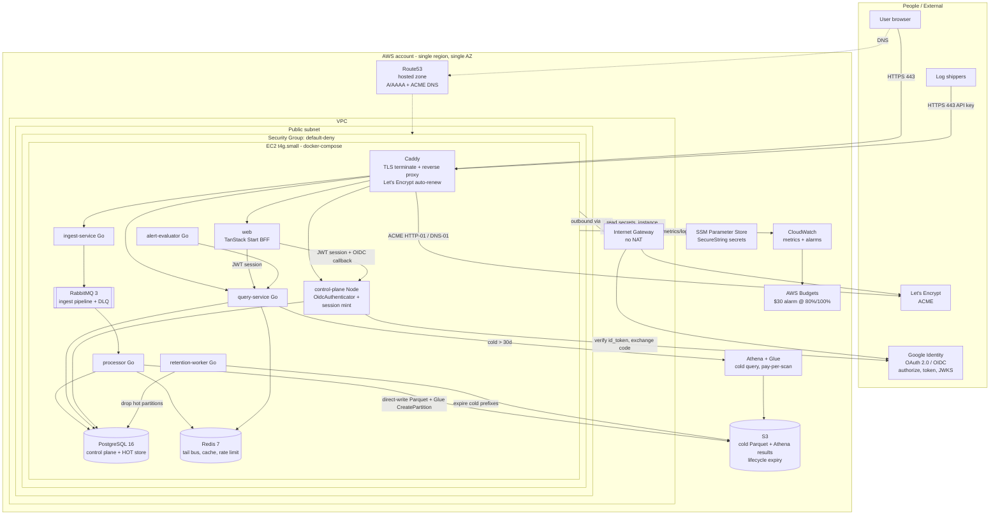

# Logalot — Google OAuth + AWS Deployment Topology

**Status:** Accepted (Phase 1) · **Date:** 2026-06-28 · **Owner:** systems architect

Companion to [`overview.md`](./overview.md). This document is descriptive; the load-bearing decisions are the
ADRs and they win on disagreement:

- [ADR-0008 Google OIDC sign-in integration](../adr/0008-google-oidc-signin.md)
- [ADR-0009 AWS deployment topology — single Graviton EC2 + compose](../adr/0009-aws-deployment-topology.md)
- [ADR-0010 IaC tooling, secrets, and TLS](../adr/0010-iac-secrets-tls.md)
- [ADR-0011 Cost as a first-class NFR — AWS PoC budget and instance sizing](../adr/0011-cost-nfr-aws-poc.md)

---

## 1. C4 Container view — deployed AWS topology (PoC)

Everything inside `box` runs as containers on **one t4g.small Graviton EC2 instance** via the existing
`docker-compose` (minus `mongodb` and `floci`, which are local-dev only — real S3/Athena replace floci in the
cloud). Managed AWS services are minimal and real.



### What is managed vs self-hosted

| Concern | Cloud choice | Rationale (ADR) |
|---|---|---|
| Compute | 1× t4g.small EC2 + compose | Cheapest credible PoC (0009, 0011) |
| Postgres / Redis / RabbitMQ | **Self-hosted** containers on the box | Avoid RDS/ElastiCache/MQ monthly bills (0009, 0011) |
| Cold storage + query | **S3 + Athena/Glue** (real) | Already the design; unblocks `cold_smoke_aws` (0005) |
| Secrets | **SSM Parameter Store** SecureString | Free tier; cheaper than Secrets Manager (0010) |
| TLS | **Caddy + Let's Encrypt** on the box | Free auto-renew; OAuth needs HTTPS; no ALB (0010) |
| DNS | **Route53** hosted zone | Real domain for OAuth + ACME (0010) |
| Egress | Public subnet + **IGW, no NAT** | NAT GW > whole compute budget (0009) |
| Guardrail | **AWS Budgets** $30 alarm | Enforced cost ceiling (0011) |

---

## 2. Google OAuth sign-in flow (Track A)

Invite-only / link-existing. `client_secret` lives server-side in `control-plane`; the `web` BFF holds only
`client_id` + `redirect_uri`. CSRF (`state`) and replay (`nonce`) protection ride a single-use,
signed+encrypted httpOnly cookie on the BFF (ADR-0008).

```mermaid
sequenceDiagram
    participant B as Browser
    participant W as web (BFF)
    participant G as Google (OIDC)
    participant C as control-plane (OidcAuthenticator)
    participant DB as Postgres (users, oauth_identities)

    B->>W: click "Sign in with Google"
    W->>W: generate state + nonce; seal {state,nonce,redirect}<br/>into httpOnly Secure SameSite=Lax cookie (~10m, single-use)
    W-->>B: 302 to Google authorize?client_id&redirect_uri&state&nonce&scope=openid email
    B->>G: authorize (user authenticates + consents)
    G-->>B: 302 to web callback?code&state
    B->>W: GET /callback?code&state (+ cookie)
    W->>W: read cookie; assert state matches; DELETE cookie (single-use)
    W->>C: POST /auth/oidc/google/callback { code, nonce }
    C->>G: exchange code -> tokens (uses client_secret)
    G-->>C: id_token (+ access_token)
    C->>G: fetch/verify JWKS (cached)
    C->>C: verify id_token: sig, iss, aud==client_id, exp,<br/>nonce==supplied, email_verified==true
    alt verification fails
        C-->>W: 401
        W-->>B: error
    else verified
        C->>DB: match by (provider,sub); else by verified email -> existing user
        alt no provisioned user matches (invite-only)
            C-->>W: 401 (reject)
            W-->>B: "not provisioned"
        else first link
            C->>DB: INSERT oauth_identities(tenant_id,user_id,'google',sub,email)
        end
        C->>C: mint access JWT + rotating refresh (same as password path)
        C-->>W: Set-Cookie httpOnly session (access+refresh)
        W-->>B: authenticated; redirect to validated target
    end
```

Key points:
- **client_secret never reaches the browser** — only `control-plane` holds it (read from SSM) and only it
  talks to Google's token endpoint (ADR-0008, ADR-0010).
- **Full `id_token` validation** (signature/iss/aud/exp/nonce) + **`email_verified==true`** closes the
  unverified-email account-takeover path.
- **Invite-only:** an authenticated Google user with no matching provisioned account is **rejected (401)** —
  no auto-provisioning.
- **Identity key:** first login links the immutable Google `sub` to the user; thereafter match by
  `(provider, sub)`, so a later Google email change does not break the link.
- **Downstream unchanged:** the minted session is the same access-JWT + rotating-refresh of ADR-0007; the
  `query-service` JWT authenticator, `TenantContext`, and kernel are untouched.

---

## 3. Open items carried to later phases

- **Migration number:** `oauth_identities` cannot be `000016` (taken by `retention_worker`); it must be
  `000017`+ — confirm ordering in the data-model phase (data-architect).
- **User email uniqueness:** Google email→user match requires globally-unique user email (or a post-login
  tenant selector, which is out of scope). Reconcile with the users schema in Phase 2 (data-architect).
- **ARM64 image builds:** CI must publish `linux/arm64` images for the Graviton box (lead-engineer).
- **`cold_smoke_aws`:** wire against the real S3 bucket this epic provisions (unblocks #63 AC#3).
- **Per-container `mem_limit`s + swap:** required for t4g.small safety (lead-engineer; ADR-0011).
- **Trust boundary / SG / admin-access + Terraform-state hardening:** delegated to security-architect.
