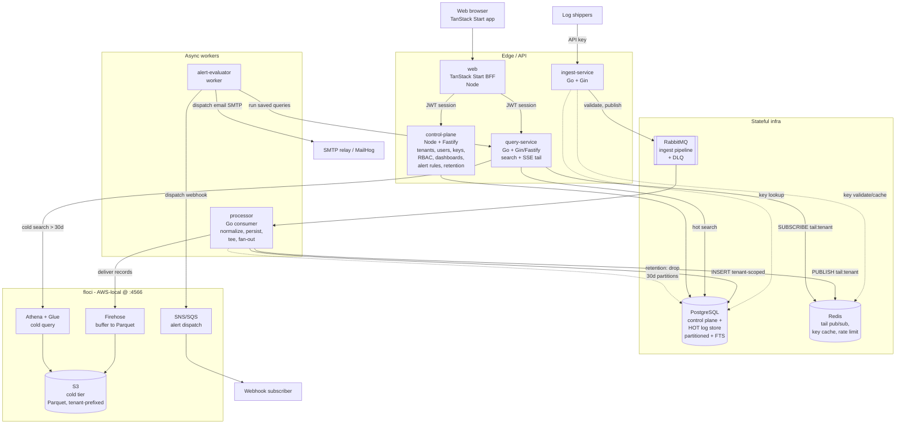
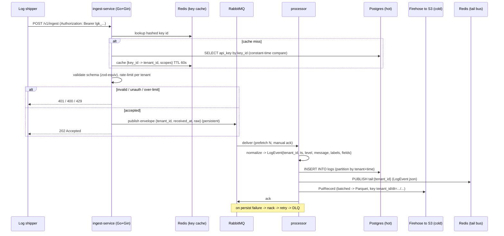
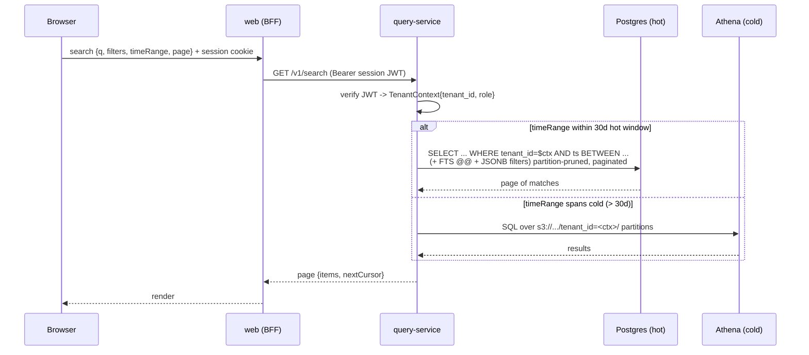
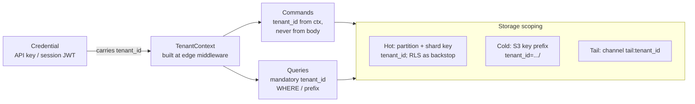

# Logalot — Architecture Overview

**Status:** Accepted (Phase 2) · **Date:** 2026-06-26 · **Owner:** systems architect

This document is the canonical system view for Logalot, a self-hostable multi-tenant
logging platform. It defines the bounded contexts, the C4 System Context and Container
views, the three core request/data flows (ingest, search, live tail), and the
end-to-end multi-tenant enforcement model.

Load-bearing decisions are recorded as ADRs in [`docs/adr/`](../adr/). This overview is
descriptive; the ADRs are normative. Where they disagree, the ADR wins.

- [ADR-0001 Service decomposition / bounded contexts](../adr/0001-service-decomposition.md)
- [ADR-0002 Multi-tenancy isolation model](../adr/0002-multi-tenancy-isolation-model.md)
- [ADR-0003 Hot log store selection](../adr/0003-hot-log-store.md)
- [ADR-0004 Ingest transport + queue](../adr/0004-ingest-transport-and-queue.md)
- [ADR-0005 Cold tier + retention/tiering](../adr/0005-cold-tier-and-retention.md)
- [ADR-0006 Live-tail mechanism](../adr/0006-live-tail-mechanism.md)
- [ADR-0007 Authn/authz model](../adr/0007-authn-authz-model.md)
- [ADR-0008 Google OIDC sign-in integration](../adr/0008-google-oidc-signin.md)
- [ADR-0009 AWS deployment topology — single Graviton EC2 + compose](../adr/0009-aws-deployment-topology.md)
- [ADR-0010 IaC tooling, secrets, and TLS](../adr/0010-iac-secrets-tls.md)
- [ADR-0011 Cost as a first-class NFR — AWS PoC budget and instance sizing](../adr/0011-cost-nfr-aws-poc.md)

Deployment topology + the Google OAuth flow are diagrammed in
[`google-oauth-aws-deployment.md`](./google-oauth-aws-deployment.md).

---

## 1. Design principles applied

- **Multi-tenancy is a first-class invariant, not a filter.** Tenant context is mandatory
  at every boundary (auth, command, query, storage, cold-tier key). There is no API that
  can run un-scoped. See §6 and ADR-0002.
- **Ports and adapters (hexagonal).** Each service exposes a thin transport adapter over a
  domain core that depends only on ports (`LogStore`, `Broker`, `TailBus`, `ColdArchive`,
  `KeyStore`, `TenantContext`). Infrastructure is swappable; the hot store in particular is
  behind a port so it can be replaced without touching the domain (ADR-0003).
- **KISS / YAGNI over hyperscale.** Targets are tuned for a credible single cluster (ADR-0003,
  `nfr.md`). We pick the simplest store/transport that meets the targets and document the
  explicit trigger that justifies escalating to a heavier option.
- **Reversible over irreversible.** Where two options are otherwise equal, the one that keeps
  future options open wins. The hot-store port is the clearest example.

---

## 2. Bounded contexts (DDD strategic view)

| Context | Responsibility | Ubiquitous language | Deployable unit(s) |
|---|---|---|---|
| **Identity & Access** | Tenants, users, API keys, sessions, RBAC, retention policy records | Tenant, User, ApiKey, Role, Session, RetentionPolicy | `control-plane` |
| **Ingestion** | Authenticated high-throughput intake, validation, backpressure, enqueue | IngestRequest, RawEvent, ApiKey, Backpressure | `ingest-service` |
| **Log Processing** | Consume from broker, normalize, persist to hot store, tee to cold, fan out to tail bus | LogEvent, Envelope, NormalizedEvent, DLQ | `processor` |
| **Log Storage & Retention** | Hot store schema, partitioning, tiering to cold, retention enforcement | LogEvent, Partition, HotTier, ColdTier, Retention | shared kernel owned by data (lives inside `processor` + `query-service`) |
| **Log Query & Search** | Full-text + structured + time-range search; pagination; live tail | Query, Filter, Match, TailSubscription, Page | `query-service` |
| **Alerting** | Threshold/rate rules over queries; evaluation; dispatch; alert state | AlertRule, Evaluation, Trigger, Notification, AlertState | `alert-evaluator` (eval) + `control-plane` (rule CRUD) |
| **Workspace** | Dashboards, saved queries (per-tenant authoring) | Dashboard, Panel, SavedQuery | `control-plane` |

Context relationships (DDD context map):

- **Identity & Access** is *upstream* of everything: it issues the `TenantContext` and
  `Principal` that every other context consumes. It is the single source of truth for "who
  and which tenant". Other contexts treat it as a **conformist** dependency — they accept the
  identity model as-is.
- **Ingestion → Log Processing** is an asynchronous **customer/supplier** relationship across
  RabbitMQ. The message envelope (`tenant_id`, `received_at`, `raw`) is the published-language
  contract between them.
- **Log Storage & Retention** is a **shared kernel** between Processing (writer) and Query
  (reader): both depend on the same partitioning scheme and hot/cold schema. Changes here are
  coordinated and versioned.
- **Alerting** and **Workspace** are downstream consumers of **Log Query** (they run saved
  queries) and of **Identity & Access**.

---

## 3. C4 Level 1 — System Context

```mermaid
graph TB
    subgraph actors[People]
        admin[Tenant Admin]
        eng[Engineer / Tenant Member]
        op[Platform Operator]
    end

    shipper[Log shippers / app services<br/>SDK, agent, curl, NDJSON]

    logalot[(Logalot<br/>Multi-tenant logging platform)]

    notify[Notification sinks<br/>Webhook (SNS) / Email (SMTP)]

    shipper -->|POST /v1/ingest<br/>API key auth| logalot
    eng -->|search, live tail,<br/>dashboards, alerts| logalot
    admin -->|provision tenant,<br/>manage keys/users/retention| logalot
    op -->|ingest health, capacity,<br/>per-tenant usage| logalot
    logalot -->|alert notifications| notify
```

Logalot is one logical system. Externally it accepts authenticated log streams from tenant
services and serves an interactive web app to humans; it pushes notifications outward when
alert rules fire.

---

## 4. C4 Level 2 — Container view



### Container responsibilities and tech fit

| Container | Tech | Why |
|---|---|---|
| `ingest-service` | Go + Gin | Throughput-critical hot path (≥50k events/s/node). Go's goroutine model + Gin give low-overhead concurrent intake; no GC pauses that blow latency budgets at this scale. (ADR-0004) |
| `processor` | Go worker | Same throughput class as ingest; CPU-bound normalization + high-fan-out writes. (ADR-0001) |
| `query-service` | Go (Gin) or Node+Fastify | Read path + long-lived SSE connections. Go preferred for SSE fan-out concurrency; Fastify acceptable if team velocity favors it. SSE chosen over WebSocket (ADR-0006). |
| `control-plane` | Node + Fastify | CRUD-heavy, not throughput-critical. Velocity + shared zod schemas with the frontend win here. |
| `alert-evaluator` | Go or Node worker | Periodic query execution; dispatch via floci SNS/SQS. |
| `web` | TanStack Start | Responsive SPA + BFF. Holds the user session, proxies to `query`/`control` with the session JWT. |

---

## 5. Core flows

### 5.1 Ingest → queue → process → store



Key points:
- The envelope carries `tenant_id` resolved **from the authenticated key**, never from the
  request body. The body cannot assert a tenant. (ADR-0002, ADR-0007)
- `ingest-service` returns `202` after the durable enqueue; persistence is asynchronous. This
  decouples intake throughput from store write latency and gives RabbitMQ-backed backpressure.
- The processor **tees**: every event is written to the hot store *and* streamed to the cold
  tier via Firehose from day 0. Cold is the durable archive; hot is the fast-search window.
  (ADR-0005)

### 5.2 Search / query



Key points:
- `tenant_id` is injected from the verified `TenantContext` and bound into **every** WHERE
  clause and **every** S3 partition prefix. It is never a query parameter the caller controls.
- Hot queries are always `tenant_id` + time-range scoped, which prunes to a small set of
  partitions — this is what makes p95 < 2s achievable on Postgres at this volume (ADR-0003).
- Cold queries read only the caller's `tenant_id=<ctx>/` prefix in S3; Athena cannot be
  pointed at another tenant's prefix because the prefix is templated from `TenantContext`.

### 5.3 Live tail

```mermaid
sequenceDiagram
    participant B as Browser (EventSource)
    participant W as web (BFF)
    participant Qs as query-service
    participant T as Redis pub/sub
    participant P as processor

    B->>W: GET /v1/tail?filters (Accept: text/event-stream)
    W->>Qs: open SSE (Bearer session JWT)
    Qs->>Qs: verify JWT -> TenantContext
    Qs->>T: SUBSCRIBE tail:{tenant_id}
    loop new events
        P->>T: PUBLISH tail:{tenant_id} (LogEvent)
        T-->>Qs: message
        Qs->>Qs: apply client filters; drop if buffer full (sampling)
        Qs-->>B: data: {LogEvent}\n\n
    end
    Note over Qs,B: heartbeat comment every 15s; auto-reconnect via EventSource
```

Key points:
- A connection can only `SUBSCRIBE` to its own `tail:{tenant_id}` channel — the channel name
  is derived from `TenantContext`, so a tenant physically cannot subscribe to another's stream.
- SSE over WebSocket: the flow is unidirectional (server→client), so SSE is simpler, gives
  native `EventSource` reconnection, and rides HTTP/2 multiplexing. (ADR-0006)
- Slow-consumer protection: bounded per-connection buffer; on overflow we sample/drop and emit
  a `gap` event rather than back up the bus.

---

## 6. Multi-tenancy enforcement model (end to end)

Defense in depth: a tenant boundary is enforced independently at **four** layers, so any single
layer's failure does not produce cross-tenant leakage. (ADR-0002)



| Layer | Enforcement | Mechanism |
|---|---|---|
| **Auth** | A credential resolves to exactly one `tenant_id` | API key → tenant binding stored at issue time; session JWT carries `tenant_id` + `role` claims. Verified at every edge middleware before any handler runs. (ADR-0007) |
| **Application** | No un-scoped repository call compiles/runs | Every port method takes `TenantContext` as its first argument; there is no overload without it. Domain repositories template `tenant_id` into every command and query. Lint/contract test forbids raw store access that bypasses the repository. |
| **Hot storage** | Physical + logical isolation | `tenant_id` is part of the **partition key** (and the primary key prefix). PostgreSQL **Row-Level Security** policy `tenant_id = current_setting('app.tenant_id')` is enabled as a backstop, set per-transaction from `TenantContext`. A missing setting denies all rows (fail-closed). (ADR-0003) |
| **Cold storage** | Path isolation | Every object is written under `s3://logalot-cold/tenant_id=<id>/dt=<date>/...`. Athena queries are generated with the `tenant_id` partition predicate bound from `TenantContext`; the Glue table is partitioned on `tenant_id` so a query for one tenant never scans another's objects. (ADR-0005) |
| **Tail bus** | Channel isolation | Redis channel `tail:{tenant_id}`; subscribe target is derived from context, not user input. |

Tenant context propagation contract:
1. Edge middleware authenticates → constructs `TenantContext{tenant_id, principal_id, role, scopes}`.
2. Context is passed explicitly down the call stack (Go `context.Context` value / Fastify request
   decorator) — no globals, no ambient request locals beyond the framework request object.
3. On the way into the hot store, the transaction sets `SET LOCAL app.tenant_id = $ctx` so RLS
   is armed even if a query forgot its predicate.
4. Cross-context calls (e.g. `alert-evaluator` → `query-service`) re-present the tenant scope as
   an explicit parameter / signed internal token; there is no "service trust = skip scoping".

Acceptance invariant (slice): *ingesting a log for tenant A never appears in tenant B's tail or
search.* This is asserted by integration tests at the auth, query, and storage layers
independently.

---

## 7. Local infrastructure topology

`docker compose up` brings up: `postgres`, `mongodb` (reserved — see ADR-0003 alternatives),
`redis`, `rabbitmq`, and `floci` (AWS-local at `http://localhost:4566`). All services read a
single `.env`; floci provides S3, Firehose, Athena/Glue, SNS/SQS. Integration tests run against
this stack (Docker-backed), satisfying the slice acceptance criterion.

> **floci coverage note.** floci's OpenSearch support is control-plane CRUD/stubs only, not a
> real search data plane — which is one reason the hot store is self-hosted Postgres, not
> OpenSearch (ADR-0003). Kinesis Data Streams and Glacier/S3-lifecycle are not relied upon; see
> the tracked floci gaps in [`nfr.md`](./nfr.md#floci-gaps--tracked-risks) and the ledger.
