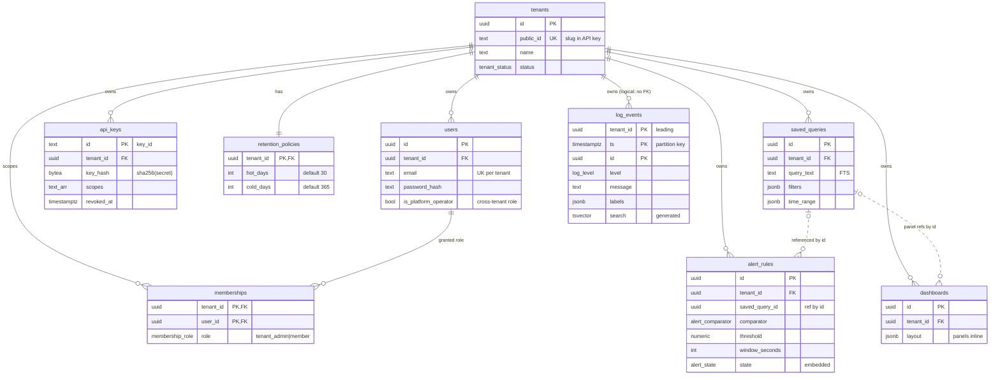

# Logalot — Data Model

**Status:** Accepted (Phase 3) · **Date:** 2026-06-26 · **Owner:** data architect

This is the canonical data model for Logalot. It builds on, and never contradicts, the
architecture (`docs/architecture/overview.md`, `nfr.md`) and the ADRs — especially
[ADR-0002](../adr/0002-multi-tenancy-isolation-model.md) (multi-tenancy),
[ADR-0003](../adr/0003-hot-log-store.md) (hot store),
[ADR-0005](../adr/0005-cold-tier-and-retention.md) (cold tier),
[ADR-0007](../adr/0007-authn-authz-model.md) (auth). Where they disagree, the ADRs win.

The schema is implemented as runnable, version-validated migrations under
[`/migrations`](../../migrations) (golang-migrate, applied + rolled back against Postgres 16).
The cold tier is specified in [`cold-tier.md`](./cold-tier.md); operations in
[`migration-plan.md`](./migration-plan.md).

---

## 1. Per-store responsibilities (polyglot persistence — justified)

Every store earns its place against the workload. We do **not** add a store we cannot justify.

| Store | Role | Why this store (and not another) |
|---|---|---|
| **PostgreSQL** | Control-plane system of record **and** the 30-day hot log store | One technology for control plane + hot logs = lowest ops burden, fully Docker-testable, RLS gives a real fail-closed tenant backstop. Partition-pruned tenant+time queries meet p95 < 2s (ADR-0003). |
| **Redis** | API-key validation cache (60s TTL), per-tenant rate limiting, live-tail pub/sub (`tail:{tenant_id}`) | Keeps the ingest hot path off Postgres (NFR-3); native pub/sub fits the unidirectional tail fan-out (ADR-0006). Not a system of record — purely ephemeral. |
| **RabbitMQ** | Durable ingest pipeline (`ingest → processor`), DLQ | Durable enqueue is the basis of "202-after-durable-enqueue" (ADR-0004). Carries the `{tenant_id, received_at, raw}` envelope, not state. |
| **floci S3 + Glue + Athena** | Cold tier: Parquet archive, tee'd from day 0, queried on demand | Cheap durable retention + pay-per-scan history; tenant isolation via S3 key prefix + Glue partition (ADR-0005). See [`cold-tier.md`](./cold-tier.md). |
| **MongoDB** | **Reserved / unused in v1 (YAGNI)** | Available in local compose but assigned no responsibility. Postgres JSONB already covers dashboards/saved-queries/labels with transactions + RLS, so a second document store would add ops cost for no gain. Documented candidate future use: only if dashboard/saved-query documents become large and schema-fluid enough that JSONB-in-Postgres is painful — not the case today. Do not force it in. |

**Aggregate → transactional-boundary rule (DDD).** Every aggregate root maps to exactly one
table whose writes are one transaction in **one** store. No aggregate spans two stores in a
single write. The processor's tee (hot Postgres + cold S3) is **not** a cross-store aggregate
write: the hot insert is the transactional write; the cold tee is a best-effort, retried
side-effect (NFR-2), and cold is reconstructable from the queue/DLQ.

---

## 2. Aggregate → table mapping

| Bounded context | Aggregate root | Table(s) | Tenant-owned? (RLS) | Migration |
|---|---|---|---|---|
| Identity & Access | **Tenant** | `tenants` | No — registry (see §4) | `000003` |
| Identity & Access | **User** | `users` + `memberships` (RBAC) | Yes | `000004` |
| Identity & Access | **ApiKey** | `api_keys` | Yes | `000005` |
| Identity & Access | **RetentionPolicy** | `retention_policies` (1:1 tenant) | Yes | `000006` |
| Workspace | **SavedQuery** | `saved_queries` | Yes | `000007` |
| Workspace | **Dashboard** | `dashboards` (panels inline JSONB) | Yes | `000008` |
| Alerting | **AlertRule** | `alert_rules` (state embedded) | Yes | `000009` |
| Log Storage & Retention | **LogEvent (hot)** | `log_events` (partitioned) | Yes | `000010` |
| Log Storage & Retention | **LogEvent (cold)** | S3 Parquet (Glue/Athena) | Yes (S3 prefix) | [`cold-tier.md`](./cold-tier.md) |

**Cross-aggregate references use identity, not hard FKs.** `dashboards.layout` panels and
`alert_rules.saved_query_id` reference a `SavedQuery` by id only. Same-tenant integrity is
guaranteed by RLS (a foreign-tenant id is simply invisible) plus repository scoping — no
composite FK is needed across aggregate roots. Within an aggregate we *do* use FKs (e.g.
`memberships → users` on `(tenant_id, user_id)`) for referential integrity.

---

## 3. ER overview



---

## 4. Multi-tenant enforcement at the data layer

This is the data-layer realization of the four-layer model in `overview.md §6` and ADR-0002.
At the **storage** layer the controls are: (a) `tenant_id` as the leading PK column / partition
prefix, (b) PostgreSQL Row-Level Security as a fail-closed backstop, (c) the mandatory
`tenant_id` predicate the repository always binds from `TenantContext`.

### 4.1 The tenant-context convention (the contract the backend relies on)

There is **one** convention, and every service adapter implements it:

```sql
-- Once per request, inside the transaction, BEFORE any tenant-scoped statement:
SET LOCAL app.tenant_id = '<tenant uuid from TenantContext>';
```

- The GUC name is **`app.tenant_id`** (matches ADR-0002 §3 and `overview.md §6`). This is the
  authoritative convention; the staff-/backend-engineer code to this exact name.
- Every RLS policy reads it through one helper (DRY):
  `app.current_tenant_id()` = `NULLIF(current_setting('app.tenant_id', true), '')::uuid`.
  The two-arg `current_setting(..., true)` returns `NULL` (not an error) when the GUC is unset.
- **Fail-closed:** when unset/blank, `app.current_tenant_id()` is `NULL`, so the policy
  predicate `tenant_id = NULL` is `NULL`→FALSE and the query/insert sees **zero rows**. Verified:
  a `SELECT` on `api_keys` with no context returns 0 rows; an `INSERT` with a foreign
  `tenant_id` is rejected with *"new row violates row-level security policy"*.
- Use `SET LOCAL` (transaction-scoped), not `SET`, so a pooled connection never leaks one
  request's tenant context into the next. On a transaction-less connection, `set_config('app.tenant_id', $1, false)` at the start of the unit of work is the equivalent.

### 4.2 RLS policy approach

Every tenant-owned table has the identical, auditable policy shape:

```sql
ALTER TABLE <t> ENABLE ROW LEVEL SECURITY;
ALTER TABLE <t> FORCE  ROW LEVEL SECURITY;          -- owner is NOT exempt
CREATE POLICY <t>_tenant_isolation ON <t>
  USING      (tenant_id = app.current_tenant_id())   -- read/update/delete visibility
  WITH CHECK (tenant_id = app.current_tenant_id());  -- insert/update cannot set a foreign tenant
```

- **`FORCE ROW LEVEL SECURITY`** is deliberate: a table's owner normally bypasses RLS. Forcing
  it means the policy holds even if the app connects as the owner. **Operational requirement:**
  the application database role **must not** be a superuser and **must not** have `BYPASSRLS`
  (superusers/BYPASSRLS bypass even FORCE). Validated with a `NOSUPERUSER` role.
- `WITH CHECK` closes the write side: a tenant cannot insert/update a row stamped with another
  tenant's id, so the body-asserted-tenant attack is dead at the storage layer too.

### 4.3 Partition-key strategy and the RLS × partitioning interaction

- `log_events` is **RANGE-partitioned by `ts`** (daily), with `tenant_id` as the **leading
  column of the primary key** `(tenant_id, ts, id)` — the tenant prefix from ADR-0003.
- **RLS works on partitioned tables.** The policy is defined on the **parent** `log_events`.
  When you query the parent, PostgreSQL applies the parent's policy and it cascades to every
  partition scan — confirmed: an insert under tenant A's context is invisible under tenant B's
  context, and partition pruning still narrows a `tenant_id`+time query to a single daily
  partition (`EXPLAIN` shows one `log_events_YYYYMMDD`, not the default).
- **Access contract:** all reads/writes go through the **parent** table `log_events`, never a
  partition directly. (RLS policies are not inherited to a child for *direct* access; routing
  through the parent is what the `LogStore` adapter does, so parent policies fully govern.)

### 4.4 How a tenant-scoped query is *guaranteed* (three independent failures required to leak)

1. The repository binds `WHERE tenant_id = $ctx` from `TenantContext` (application layer).
2. `SET LOCAL app.tenant_id` arms RLS; even a forgotten predicate returns only that tenant's
   rows (storage layer).
3. The credential resolved to exactly one `tenant_id` at the edge (auth layer, ADR-0007).

A cross-tenant leak requires all three to fail at once. Fitness tests (NFR-6) assert each
independently, including the "context unset ⇒ zero rows" backstop.

### 4.5 The two registry/scheduler exceptions (documented on purpose)

- **`tenants` has no RLS.** It is the tenant *registry*, not a tenant-owned table. Provisioning
  a new tenant happens before any tenant context exists, so RLS would be a chicken-and-egg
  problem. Access is governed by control-plane role checks: `platform_operator` manages
  lifecycle; a tenant reads only its own row via `id = app.current_tenant_id()` enforced in the
  repository.
- **The ingest key lookup is tenant-scoped, not unscoped.** Auth is a chicken-and-egg too (the
  key *is* what establishes the tenant). Resolution: the presented key
  `lgk_<publicId>_<keyId>_<secret>` carries the tenant slug; ingest resolves
  `tenants.public_id → id`, runs `SET LOCAL app.tenant_id`, *then* does the scoped
  `SELECT … WHERE id = <keyId>` and constant-time compares `key_hash`. So even auth runs inside
  RLS.
- **The alert-evaluator scheduler** needs to find *due rules across all tenants*, which FORCE
  RLS would hide. It uses a dedicated role with `BYPASSRLS` **only** to read rule scheduling
  metadata `(tenant_id, rule_id, last_evaluated_at)` — never log content. It then re-enters each
  rule's tenant context (`SET LOCAL app.tenant_id`) before running the query against
  `log_events`, so log reads remain RLS-governed. This is consistent with `platform_operator`
  being barred from tenant log content (NFR-5.4).

---

## 5. Hot log store — `log_events` in detail (ADR-0003)

Full DDL: [`/migrations/000010_log_events.up.sql`](../../migrations/000010_log_events.up.sql).

### 5.1 Column set

| Column | Type | Notes |
|---|---|---|
| `tenant_id` | `uuid` NOT NULL | Leading PK column / tenant prefix; RLS key. No FK to `tenants` (hot-path write cost; tenant validity guaranteed by auth before enqueue). |
| `ts` | `timestamptz` NOT NULL | Event time; the **partition key**. BRIN-indexed. |
| `id` | `uuid` NOT NULL `gen_random_uuid()` | Tie-breaker; second half of the keyset cursor. |
| `service` | `text` NOT NULL | Emitting service; btree-indexed with ts; folded into the FTS vector. |
| `level` | `log_level` enum NOT NULL | `trace<debug<info<warn<error<fatal`; enum order supports `level >= 'warn'`. |
| `message` | `text` NOT NULL | Primary FTS source. |
| `labels` | `jsonb` NOT NULL `{}` | Structured fields/labels; GIN(`jsonb_path_ops`) for `@>` containment. |
| `trace_id`, `span_id` | `text` NULL | Trace correlation; present now so tracing is not precluded (spec). |
| `raw` | `jsonb` NOT NULL `{}` | Original normalized envelope for fidelity/replay. |
| `search` | `tsvector` **GENERATED STORED** | `to_tsvector('english', message || ' ' || service)`; the 2-arg `to_tsvector(regconfig,text)` is IMMUTABLE, so it is valid in a stored generated column (verified). |

Primary key `(tenant_id, ts, id)`: tenant prefix + the partition key (`ts` must be in the PK of
a partitioned table) + uniqueness/cursor tiebreak.

### 5.2 Partitioning scheme & pruning

- **Daily RANGE partitions** on `ts`, named `log_events_YYYYMMDD`, `FOR VALUES FROM (day) TO (day+1)`.
- A **DEFAULT partition** `log_events_default` catches out-of-range rows. In steady state it
  stays empty because partitions are created ahead of time (the ensure job). Caveat noted in the
  migration: a non-empty default blocks attaching an overlapping new partition — the ahead-of-time
  job is what keeps it empty.
- Every tenant query is `tenant_id` + time-range scoped, so the planner **prunes** to the few
  daily partitions the range touches (confirmed by `EXPLAIN`: one partition for a 1-hour range).
  This is what makes p95 < 2s achievable on Postgres regardless of total cluster volume (NFR-1/3).

### 5.3 Indexes (all created on the parent ⇒ auto-applied to every partition)

| Index | Type | Serves |
|---|---|---|
| `(tenant_id, ts, id)` PK | btree | Keyset pagination `ORDER BY ts DESC, id DESC` via backward scan; uniqueness. |
| `idx_log_events_ts_brin` | **BRIN**(`ts`) `pages_per_range=32` | Cheap time-range scan within a partition (ts is append-correlated). |
| `idx_log_events_search` | **GIN**(`search`) | Full-text `@@ websearch_to_tsquery(...)` (verified). |
| `idx_log_events_labels` | **GIN**(`labels jsonb_path_ops`) | Structured label/field `@>` filters (verified). |
| `idx_log_events_svc_ts` | btree(`tenant_id, service, ts DESC`) | Per-service, time-ordered. |
| `idx_log_events_lvl_ts` | btree(`tenant_id, level, ts DESC`) | Per-level (e.g. errors), time-ordered. |

GIN FTS write amplification is the known risk (ADR-0003): mitigate with batched inserts from the
processor, `fastupdate`/`gin_pending_list_limit` tuning, and the tight 30-day hot window. The
escape hatch (ClickHouse behind the `LogStore` port) is pre-committed, not pre-paid.

### 5.4 Keyset pagination (not OFFSET)

```sql
SELECT … FROM log_events
WHERE tenant_id = app.current_tenant_id()
  AND ts >= $from AND ts < $to
  AND (ts, id) < ($cursor_ts, $cursor_id)   -- omit on first page
ORDER BY ts DESC, id DESC
LIMIT $n;
```

Served by a backward scan of the PK index; cost is independent of page depth.

### 5.5 Retention via partition drop (30d)

- `app.drop_log_events_partitions_older_than(p_retention_days int DEFAULT 30)` drops daily
  partitions older than the cutoff in O(1) each — no `DELETE` churn. It matches only
  `log_events_YYYYMMDD` partitions and **never** the default (verified: dropping a 40-day-old
  partition removed exactly it; the default survived).
- **Pooled-store nuance:** partitions are time-only, so the shared drop happens at the **global
  hot horizon** (default 30d). A tenant whose `retention_policies.hot_days` is *shorter* has its
  excess pruned by an optional tenant-scoped `DELETE` (off the hot path) and otherwise relies on
  cold. True per-tenant retention (`cold_days`) is enforced cheaply by S3 prefix delete
  (see [`cold-tier.md`](./cold-tier.md)). This honesty is intentional — see ADR-0005.

### 5.6 Partition creation (ahead of time)

- `app.create_log_events_partition(p_day date)` — idempotent single-day create.
- `app.ensure_log_events_partitions(p_days_ahead int DEFAULT 7)` — ensures today..+N exist; runs
  on a schedule so ingest never falls into the default. The migration bootstraps today..+7 so the
  vertical slice works immediately after `migrate up`.
